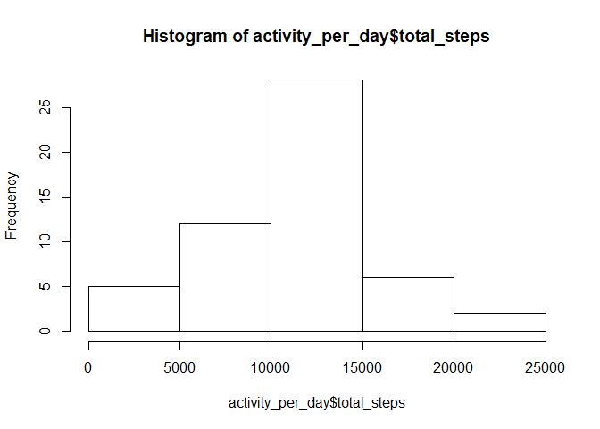
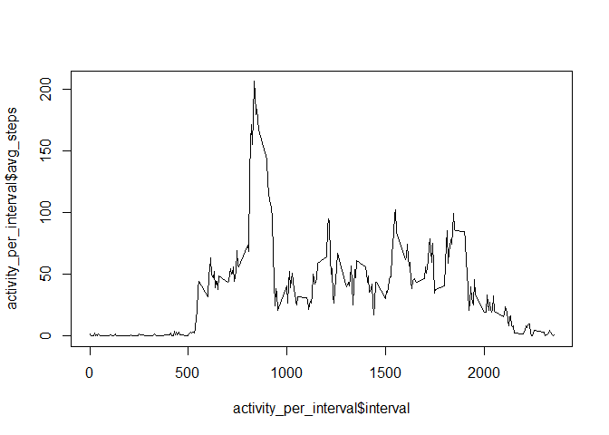
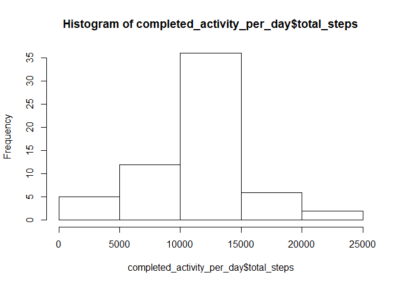
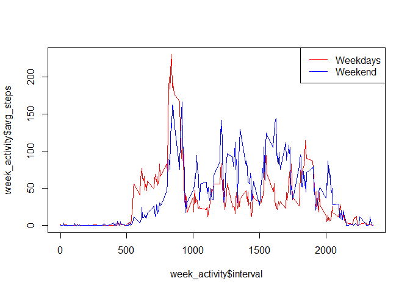

## Loading and preprocessing the data

Assuming we're in the working directory from the forked repository this will load the data into the variable called activity.We'll load the dplyr package as well for use later on.


```r
library(dplyr)
```

```
## 
## Attaching package: 'dplyr'
```

```
## The following objects are masked from 'package:stats':
## 
##     filter, lag
```

```
## The following objects are masked from 'package:base':
## 
##     intersect, setdiff, setequal, union
```

```r
if (!file.exists("activity.csv")) { 
  unzip("activity.zip")
}

activity<-read.csv("activity.csv")
```


## What is mean total number of steps taken per day?

To get the mean number of steps taken per day we first sum up the steps for each day in the dataset. From that data we can create a histogram and show some basic statistics.


```r
activity_per_day<-activity %>% group_by(date) %>% summarise(total_steps=sum(steps))

hist(activity_per_day$total_steps)
```

<!-- -->

```r
summary(activity_per_day$total_steps)
```

```
##    Min. 1st Qu.  Median    Mean 3rd Qu.    Max.    NA's 
##      41    8841   10765   10766   13294   21194       8
```

## What is the average daily activity pattern?
To answer this question we'll caclulate the average number of steps per time interval over all the days and plot it in a time series.


```r
activity_per_interval<-activity %>% group_by(interval) %>% summarise(avg_steps=mean(steps, na.rm=TRUE))

plot(activity_per_interval$interval, activity_per_interval$avg_steps,  type="l")
```

<!-- -->

We see that the maximum number of steps on average in a 5 minute interval is at:


```r
max(activity_per_interval$avg_steps)
```

```
## [1] 206.1698
```

This maximum occurs at interval:


```r
activity_per_interval$interval[which.max(activity_per_interval$avg_steps)]
```

```
## [1] 835
```


## Imputing missing values

Looking at the summary of the data we see missing vlaues for the steps:


```r
summary(activity$steps)
```

```
##    Min. 1st Qu.  Median    Mean 3rd Qu.    Max.    NA's 
##    0.00    0.00    0.00   37.38   12.00  806.00    2304
```


To make the data complete we'll assume that the missing values are similar to the average for each 5 minute interval.


```r
completed_activity<-merge(activity,activity_per_interval, by="interval", all=TRUE)

completed_activity$steps[is.na(completed_activity$steps)]<-completed_activity$avg_steps[is.na(completed_activity$steps)]
```

After doing this we'll have a look at the basic statistics again.


```r
completed_activity_per_day<-completed_activity %>% group_by(date) %>% summarise(total_steps=sum(steps))

hist(completed_activity_per_day$total_steps)
```

<!-- -->

```r
summary(completed_activity_per_day$total_steps)
```

```
##    Min. 1st Qu.  Median    Mean 3rd Qu.    Max. 
##      41    9819   10766   10766   12811   21194
```


## Are there differences in activity patterns between weekdays and weekends?
First add the category weekend or weekday to the data. We'll use the completed data for this.


```r
completed_activity$week_or_weekend <- ifelse(weekdays(as.Date(completed_activity$date)) %in% c("zaterdag","zondag"),"weekend","weekday")
```

After this plot it as 2 different lines.


```r
completed_activity_per_interval<-completed_activity %>% group_by(interval,week_or_weekend) %>% summarise(avg_steps=mean(steps))
week_activity<-subset(completed_activity_per_interval, week_or_weekend=="weekday")
weekend_activity<-subset(completed_activity_per_interval, week_or_weekend=="weekend")
plot(week_activity$interval, week_activity$avg_steps, col="red", type="l")
lines(weekend_activity$interval, weekend_activity$avg_steps, col="blue",  type="l")
legend("topright",lty=1,col=c("red","blue"),legend=c("Weekdays","Weekend"))
```

<!-- -->
